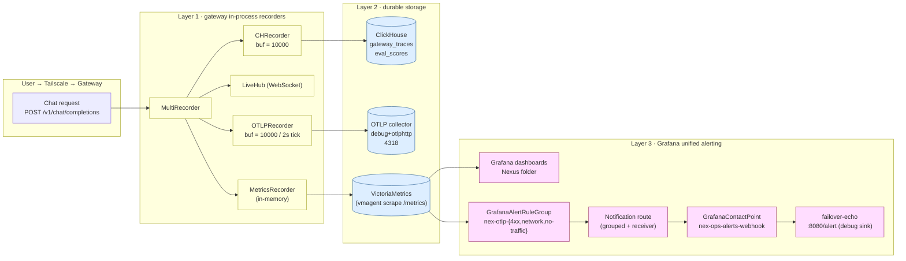

# Nexus V0.5 observability datapath (architecture)

This document captures the **end-to-end observability pipeline** that
ships in V0.5.0 — every hop between an incoming chat request and the
trace data that ends up materialized in ClickHouse, OTLP collector,
VictoriaMetrics, and Grafana. It is the reference diagram for:

* on-call incident triage
* capacity planning
* vendor / tool swaps
* onboarding new propagators

Render the Mermaid blocks inline on GitHub/GitLab/Fun-FX internal
wiki, or run `mmdc` locally to regenerate the SVG.

## Three-layer model

Every observability datapath in Nexus fits the same three-layer shape:

```
┌──────────────┐        layer 1 — hot-path fan-out        ┌──────────────┐
│  user chat   │ ──────────────────────────────────────► │   gateway    │
└──────────────┘                                           │  (in-process │
                                                           │   recorders) │
                                                           └──────┬───────┘
                                                                  │  flush
                                                                  ▼
┌──────────────┐  layer 2 — durable storage      ┌─────────────────────────────┐
│  diagnostics │ ◄──────────────────────────────── │ backend recorders (off-hot) │
│  dashboards  │                                   │  • ClickHouse  (gateway_    │
│  SQL, etc.   │                                   │    traces, eval_scores)     │
│              │                                   │  • OTLP collector           │
│              │                                   │    (resource spans)         │
└──────┬───────┘                                   │  • VictoriaMetrics          │
       │                                           │    (Prometheus exposition) │
       │                                           └─────────────────────────────┘
       │                                                  ▲
       │   layer 3 — query + alert                       │ scrape / query
       └──────────────────────────────────────────────────┘
```

Each layer has its own failure semantics. The hot-path layer **never**
blocks a request; durable storage has its own **retry / batch** discipline;
the query layer is **eventually consistent** (default 1m evaluation).

## Layer 1 — gateway recorders (`internal/observability`)

The gateway compiles a `MultiRecorder` in `cmd/nexus/compose.go`. One
`Trace` flows through this fan-out — every recorder fires its own side
effect without the gateway having to know whether any of them is on:

```
                         ┌────────────────┐
   Trace → MultiRecorder ┤→ ClickHouse    │  (gateway_traces)
                         ├→ Live Hub (WS) │  (in-memory console feed)
                         ├→ OTLP exporter │  (resourceSpans POST to 4318)
                         ├→ Prometheus    │  (counters + histograms)
                         └→ Eval worker   │  (post-LLM async judge)
```

`internal/observability/multi.go` fans each `Record(t)` call out to every
non-nil child. Each child is constructed in `compose.go` gated by an
opt-in env var (`NEXUS_CLICKHOUSE_URL`, `NEXUS_OTLP_ENABLED`,
`NEXUS_METRICS_ADDR`, …). When the env var is empty the recorder
returns `nil` and the fan-out silently skips it — so the same binary
runs equally on a tiny local-dev laptop and on a multi-replica
production cluster.

### Hot-path invariants (non-block guarantees)

1. `Record(t)` succeeds in **O(1)** — it does a non-blocking channel
   send (`select { case ch <- t: default: drop }`).
2. The flusher goroutine owns **all** I/O. A slow ClickHouse can never
   add latency to a proxied chat.
3. When a buffer overflows, the trace is **dropped**, never back-pressured.
   Observability must never take down traffic.

## Layer 2 — durable storage

Three independent sinks. Operators should treat them as **redundant**
sources of truth — cross-checking between them is how V0.5 ships data
integrity (E2 verified 3-way sync).

### ClickHouse (`gateway_traces`, `eval_scores`)

```sql
CREATE TABLE gateway_traces
(
    trace_id            String,
    span_id             String,
    parent_span_id      String,
    timestamp           DateTime64(3),
    org_id              String,
    virtual_key_id      String,
    operation_name      LowCardinality(String),
    request_model       LowCardinality(String),
    response_model      LowCardinality(String),
    input_tokens        UInt32,
    output_tokens       UInt32,
    finish_reason       LowCardinality(String),
    status_code         UInt16,
    error_type          LowCardinality(String),
    error_message       String,
    -- ... the same fields as otel recorders pre-aggregation
)
ENGINE = MergeTree
PARTITION BY toDate(timestamp)
ORDER BY (org_id, timestamp, trace_id)
TTL toDateTime(timestamp) + INTERVAL 90 DAY;
```

`CHRecorder` (`internal/observability/clickhouse.go`) buffers up to
500 traces per batch and flushes every 2 s. The native-protocol DSN
skips query-side parsers entirely.

### OTLP collector (`otel/opentelemetry-collector-contrib:0.111.0`)

The collector receives a single batch via `POST /v1/traces` wrapped in
the OTLP JSON envelope:

```
{
  "resourceSpans": [
    { "resource": {"attributes":[...]}, "scope_spans":[{"scope":{...},"spans":[…]}] },
    ...
  ]
}
```

> **Wire-format note**: the envelope is mandatory. The bare `[Trace]`
> array shape that pre-V3 sent returns `400 readSpan.spanId: parse
> span_id: invalid length` from the receiver. See PR #102 / #104 /
> #105 (`internal/observability/otel.go`).

Two backends the operator can wire from the collector's `receivers` /
`exporters` block:

* **debug** exporter: prints each span to stdout (used in our
  `07-otel-collector.yaml` for sanity; quiet enough for debugging but
  not for production load).
* **otlphttp/otlpgrpc** exporters: forward to Tempo / Honeycomb /
  Jaeger etc. — the collector is mostly a transport shim here.

### VictoriaMetrics (`vmdefault`)

`MetricsRecorder` (`internal/observability/metrics.go`) keeps in-memory
counters by `(model, status, credential_source)` etc. and exposes them
on `/metrics` in Prometheus exposition format. vmagent (part of the
Cozystack stack) scrapes that endpoint every 30 s and stores in
VictoriaMetrics' default cluster (`tenant-root`).

Three OTLP-specific metrics ship in V0.5.0 (added in PR #106):

```
nexus_otlp_export_failures_total{reason="http_4xx|http_5xx|network|other"}
nexus_otlp_export_traces_total              # successful POSTs
nexus_otlp_export_bytes_total               # payload bytes sent
```

`reason=` is set in `cmd/nexus/compose.go --internal/observability/otel.go`
via `otlpStatusReason(httpCode)`. The hooks are nil-safe so the OTLP
exporter works in the zero-dep fast path (no MetricsRecorder).

## Layer 3 — query + alert

```
Grafana (3000 / folder=Nexus)
├── ContactPoint: nex-ops-alerts-webhook → failover-echo:8080/alert
├── AlertRuleGroup: nex-otlp-alerts
│     ├── nex-otlp-4xx-sustained     (severity: critical, for: 5m)
│     ├── nex-otlp-network-flapping  (severity: warning,  for: 3m)
│     └── nex-otlp-no-traffic        (severity: warning,  for: 10m)
└── NotificationPolicy: nex-mute-collectors (mute_time_intervals)
```

`deploy/cozystack/10-grafana-alerting.yaml` ships these as Grafana
operator `v1beta1` CRs (`GrafanaContactPoint`, `GrafanaAlertRuleGroup`,
`GrafanaFolder`). The folder UID is hard-coded to `efs9gg516w5xca` —
the canonical UID Grafana assigns when our `GrafanaDashboard` CRs are
reconciled with `folder: "Nexus"`.

### Dependency walkthrough (V0.5.0 production)



## Trace lifecycle (one request)

```mermaid
sequenceDiagram
    participant U as User
    participant G as Gateway
    participant CHR as CHRecorder
    participant OTL as OTLPRecorder
    participant COL as Collector
    participant VMA as vmagent
    participant VG as VictoriaMetrics
    participant GRA as Grafana

    U->>G: POST /v1/chat/completions (50ms)
    G->>G: provider call (~800ms)
    G->>CHR: Record(Trace)  [ch.send, non-blocking]
    G->>OTL: Record(Trace)  [ch.send, non-blocking]
    Note over G,OTL: hot path done; coordinates respond to user

    par ClickHouse flush (every 2s)
        CHR->>CHR: ticker fires
        CHR->>CHR: drain batch (≤500 traces)
        CHR->>CHR: INSERT INTO gateway_traces ...
    and OTLP flush (every 2s)
        OTL->>OTL: ticker fires
        OTL->>OTL: build {resourceSpans:[...]}
        OTL->>COL: POST /v1/traces (application/json)
        alt 2xx
            COL->>COL: decode + forward via debug/otlphttp exporters
            OTL->>G: r.successHook(len(payload))  → counter ↑
        else 4xx/5xx/network
            OTL->>G: r.failureHook(reason)        → failures_total{reason=...} ↑
        end
    end

    par vmagent (every 30s)
        VMA->>G: GET /metrics
        VMA->>VG: remote_write
        VG->>GRA: 1-minute eval tick
        GRA->>GRA: max(nexus_otlp_export_failures_total{reason="network"}) > 0
        alt fire
            GRA->>GRA: post alert to nex-ops-alerts-webhook
            GRA->>Echo: POST /alert (runbook + state)
        end
    end
```

## What we measure (and what we don't)

| Observable | Source | Endpoint | Retention |
|---|---|---|---|
| Per-trace data | ClickHouse | `gateway_traces`, `eval_scores` | 90 days |
| Per-trace OpenTelemetry | OTLP collector → debug/otlphttp | `POST /v1/traces` | depends on fan-out |
| Counters + histograms | vmagent → VictoriaMetrics | `GET /metrics` (9101) | 30 days |
| Eval quality scores | ClickHouse | `eval_scores` | 90 days |
| Live activity | WebSocket stream | console WebSocket | ephemeral |
| Cost (USD per model) | in-memory | `/metrics` `nexus_gateway_cost_usd_total` | 30 days |

We **do not** currently:

* Snapshot `input_messages` / `output_messages` content for any
  retention period (capture is opt-in, deleted from memory at flush).
* Persist a `parent_service` graph — the parent trace is captured as
  `parent_span_id` but there is no async aggregation that joins
  propagated parents across services today.
* Track billing / rate-limit defaults in observability — those live in
  the gateway logs only.

## Failure modes

| Layer | Path | Symptom | First check | Fallback |
|---|---|---|---|---|
| 1 (hot) | recorder channel full | trace dropped silently | `nexus_otlp_export_failures_total` and OTLP batch size diff | increase buffer / scale replicas |
| 1 (hot) | OTLPRecorder.send flushes | 4xx from collector | receiver-side `body_prefix` in WARN | fix envelope (`#102-#105`) |
| 2 (CH) | ClickHouse down | traces dropped | `gateway_traces` lag | check `chi-clickhouse-nexus` pod |
| 2 (OTLP) | collector down | traces dropped | `nexus_otlp_export_failures_total{reason="network"}` | restart collector; OTLP loses in-flight batches (V0.5 known limitation) |
| 2 (VM) | vmagent scrape fails | counter gap | point-in-time `up{job="nexus"}==0` | restart vmagent |
| 3 (Grafana) | eval fails | rule does not fire | scheduler logs `data source not found` | pin real datasource UID in YAML |
| 3 (alerting) | rule paused | alert stays Pending | `isPaused` field on rule | apply via `kubectl apply -f` |

## Future V0.6 hardening (not yet landed)

* **OTLP file_storage queue** so the collector buffers across pod
  restarts (V0.5 ships without — outage trace loss is a known gap).
* **Multi-protocol gateway dashboard** — the current panel is ×3
  (overview / llm-spend / eval-quality); V0.6 wants per-org filtering.
* **External Alertmanager** — Grafana unified alerting has its own
  embedded AM; production teams that already run VMAlertmanager
  should wire the contact-point JSON to it (we use the failover-echo
  sink as a placeholder).
* **Org-level tenant filter on every panel** — V0.6 multi-tenant rule
  for the audit-logical schema.

## Acceptance tests

Run these in order as the operator's smoke check after a V0.5 deploy:

1. `curl -s http://nexus:9101/metrics | grep ^nexus_otlp_export` — should
   return at least `nexus_otlp_export_traces_total` (counter present,
   may be 0).
2. Send 10 chat requests. After 5 s:
   * `nexus_otlp_export_traces_total` increases by ≥1.
   * OTLP collector log shows a `TracesExporter resource spans: N, spans: N` line.
   * ClickHouse `SELECT count() FROM gateway_traces WHERE timestamp > now() - INTERVAL 1 MINUTE` = N.
3. Scale `otel-collector` Deployment to 0, send 5 more requests. After
   30 s `nexus_otlp_export_failures_total{reason="network"}` ≥ 5.
4. Wait `for: 3m` plus eval tick. Verify `failover-echo` log received POST.
5. Restore collector; verify `traces_total` resumes incrementing.

If any of these fail, the matching runbook under
[`docs/observability/`](.) will guide the next step:

* [`otlp-4xx-runbook.md`](./otlp-4xx-runbook.md) — collector rejects
  the envelope.
* [`otlp-network-runbook.md`](./otlp-network-runbook.md) — DNS / dial
  /TLS / reset failures.
* [`otlp-no-traffic-runbook.md`](./otlp-no-traffic-runbook.md) —
  recorder is wedged, not failing.
